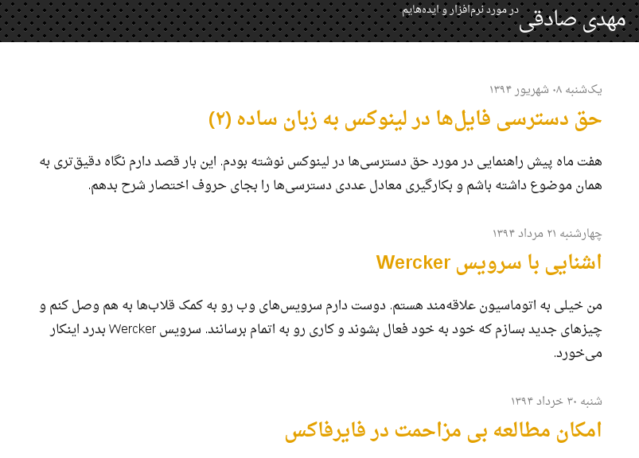

mehdix.ir
=========


This is the source code of my personal Persian [website](http://mehdix.ir). Persian aka Farsi is written right-to-left, however some people use Roman script to write Persian language in messaging applications and social networks.

This repository can be of use to anybody willing to build a new right to left website. I gradually fix issues which I came across while writing new posts in my website. This website is produced using [Jekyll](http://jekyllrb.com/) static site generator.

# Helfpul Tips
- **Hosting on GitHub Pages will fail** due to lack of necessary gems on their build servers.
- See [jekyll-theme-mehdix-rtl](https://github.com/mehdisadeghi/jekyll-theme-mehdix-rtl) for a GitHub Actions build.

## Static Comments
Having a comment section on a truely static website (a bunch of documents indeed) is 
impossible. For HTML forms should be handled on a server. This website used Disqus
in the beginning, then Netlify forms and now a [CGI](src/cgi-bin/submit) script on my own self-hosted server. The script stores submissions in a sqlite3 database. See the
[schema.sql](scripts/schema.sql) for the data model. The [build script](scripts/build.sh) exports comments from the sqlite3 database into [data files](src/_data/comments). These files in turn are used to generate the static comments upon page builds.

I use nginx and fcgiwrap for running the script. Some environment variables are necessary, such as database location and a simple value as puzzle solution.

### nginx & fcgiwrap
The latest comment section uses a CGI script along with a sqlite3 database. For running CGI scripts I used [fcgiwrap](https://github.com/gnosek/fcgiwrap/). After installation on Ubuntu I enabled the `fcgiwrap.service`. I use the following block to handle `cgi-bin` path on nginx:

```
location /cgi-bin/ {
    gzip off;
    fastcgi_pass  unix:/var/run/fcgiwrap.socket;
    include /etc/nginx/fastcgi_params;
    fastcgi_param ALEF_DB       "/path/to/my/sqlite/db";
    fastcgi_param ALEF_PUZZLE   "puzzle_answer";
    fastcgi_param SCRIPT_FILENAME  $document_root$fastcgi_script_name;
}
```
The comment form submits a POST request to `cgi-bin/submit` URL which will be handle by this script. The `scripts/rebuild_commends.py` is updated to rebuild comments from the sqlite3 database. The path should be available at `ALEF_DB` env variable. See the [Makefile](Makefile) for the build commands.

# Make it yours [outdated]
Take the following steps to make your own website:

  1. Fork the repository
  2. Edit CNAME file and replace its content with your domain name
  3. [Add an A record](https://help.github.com/articles/tips-for-configuring-an-a-record-with-your-dns-provider/) with your DNS provider to point to Github nameservers (otherwise your website would be only reachable under
  *username.github.io* or *username.github.io/repository_name*).
  4. Edit _config.yml to reflect your information
  5. Move _posts/* contents to _drafts/* or delete them (you can use them as template)
  6. Edit _includes/footer.html and edit feedburner and validation links. Alternatively
  	you can delete any link that you don't like. To use feedburner you have to setup an
  	account there for your website.
  7. Write your awesome stories :heart:

  ## Important note
  In order to [build](http://mehdix.ir/jekyll-structure.html) the website correctly, you have to 
  name the forked repository different from your username. If you put it under a repository like *yourusername.github.io* Github will use its own Jekyll builder to build your website, no matter what you put inside *gh-pages* branch. Happy writing!
